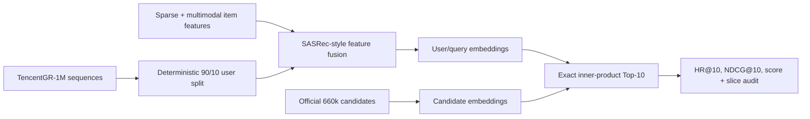

# TencentGR-1M 2025 Generative Recommendation Reproduction

[](https://github.com/yiyidaishui7/tencentgr-1m-2025-reproduction/actions/workflows/tests.yml)
[](LICENSE)
[](https://huggingface.co/sixteensun/tencentgr-1m-2025-reproduction)
[](https://huggingface.co/datasets/TAAC2025/TencentGR-1M)

[中文说明](README_CN.md) · [Detailed results](docs/RESULTS.md) · [Resume kit](docs/RESUME.md) · [Model weights](https://huggingface.co/sixteensun/tencentgr-1m-2025-reproduction)

An independent, non-official reproduction of the 2025 Tencent Ads Algorithm
Competition baseline on TencentGR-1M. The project turns the official starting
point into an auditable end-to-end pipeline: deterministic training,
multimodal feature fusion, candidate encoding, exact Top-10 retrieval, offline
evaluation, ablation, SafeTensors publication, and verified artifact handling.

> This is a reproducible offline study, not an official competition submission
> or a claim of leaderboard placement.

## Results at a glance

| Metric | Multimodal | No-MM | No-MM relative delta |
|---|---:|---:|---:|
| Evaluated users | 78,921 | 78,921 | — |
| HR@10 | 0.0313478 | **0.0317533** | +1.29% |
| NDCG@10 | 0.0159694 | **0.0165208** | +3.45% |
| Competition-style score | 0.0207367 | **0.0212429** | +2.44% |
| Final validation BCE | 0.2043 | **0.2040** | — |
| Offline evaluation runtime | 241.5 s | **133.9 s** | -44.54% |

The evaluation uses a seeded 90/10 user split and holds out the last click from
each validation sequence. Histories contain only earlier events, and retrieval
runs against the official 660k candidate pool. See [the full evaluation
contract and slices](docs/RESULTS.md).

The no-MM run is a paired, same-protocol ablation: user IDs, targets, and
history lengths match row by row. Its point estimate is higher, but the paired
95% interval for score delta includes zero and each configuration has only one
training seed. The result therefore motivates better multimodal fusion; it
does not establish that multimodal information is generally harmful.

## System overview



## What was engineered beyond the baseline

- Replaced hard-coded accelerator and filesystem assumptions with portable
  CPU/CUDA/Ascend device and path handling.
- Added deterministic user splitting, seeded data loading, bounded smoke runs,
  checkpoint resume, and a no-multimodal-feature ablation.
- Audited public/legacy candidate schemas and normalized item IDs across
  sequence, feature, multimodal, candidate, and retrieval files.
- Added a PyTorch exact inner-product Top-10 backend so evaluation does not
  depend on a machine-specific Faiss executable.
- Implemented a leakage-aware last-click offline evaluator with aggregate and
  history-length slice metrics.
- Added SafeTensors loading and published a 48-tensor checkpoint verified
  tensor-by-tensor against the evaluated PyTorch state dict.
- Added regression tests for device routing, candidate decoding, binary ANN
  I/O, holdout construction, and competition metric weighting.

## Reproduce

### 1. Install

```bash
python -m venv .venv
source .venv/bin/activate  # Windows: .venv\Scripts\activate
pip install -r requirements.txt
```

For Ascend environments, keep the image-matched `torch`/`torch_npu` pair and
use `requirements-npu.txt` for the remaining packages.

### 2. Download and validate data

```bash
python scripts/download_tencentgr_1m.py /data/TencentGR-1M
python scripts/validate_tencentgr_1m.py /data/TencentGR-1M
python scripts/audit_id_alignment.py /data/TencentGR-1M
```

The raw 137 GB dataset is not mirrored in this repository. Use the
[official TencentGR-1M repository](https://huggingface.co/datasets/TAAC2025/TencentGR-1M).

### 3. Train

```bash
python main.py \
  --data_path /data/TencentGR-1M \
  --device cuda:0 \
  --output_dir ./outputs \
  --seed 2025
```

Run the ablation with `--disable_mm_emb`. Short smoke runs can use
`--max_train_steps` and `--max_valid_steps`.

### 4. Download the evaluated checkpoint

```bash
pip install -U huggingface_hub
hf download sixteensun/tencentgr-1m-2025-reproduction model.safetensors \
  --local-dir ./weights
```

### 5. Evaluate Top-10 retrieval

```bash
python offline_eval.py \
  --data_path /data/TencentGR-1M \
  --checkpoint ./weights/model.safetensors \
  --output_dir ./offline_eval \
  --scratch_dir ./offline_eval_scratch \
  --device cuda:0
```

## Repository layout

```text
├── main.py / model.py / dataset.py    # training and model
├── infer.py / eval.py                 # candidate encoding and retrieval
├── offline_eval.py                    # audited last-click evaluation
├── candidate_utils.py                 # schema and ID normalization
├── runtime_utils.py                   # device, seed, checkpoint portability
├── scripts/                           # download and dataset audits
├── tests/                             # regression tests
├── metrics/offline_metrics*.json      # machine-readable paired metrics
├── metrics/ablation_comparison.json   # alignment, deltas, uncertainty
└── docs/                              # results and resume-ready material
```

## Verification

```bash
python -m unittest discover -s tests -v
python -m compileall -q .
```

The published model file has SHA-256
`1d53197a6c09fca20ad1c24d702a92a58adfc972f77f7236be3283d065db859b`.

## Attribution and license

This work is derived from the
[official 2025 Tencent Ads baseline](https://github.com/TencentAdvertisingAlgorithmCompetition/baseline_2025),
licensed under CC BY-NC 4.0. TencentGR-1M is published by TAAC2025 under
CC BY 4.0. This repository therefore uses CC BY-NC 4.0 and is restricted to
non-commercial use. See [ATTRIBUTION.md](ATTRIBUTION.md) and [LICENSE](LICENSE).
