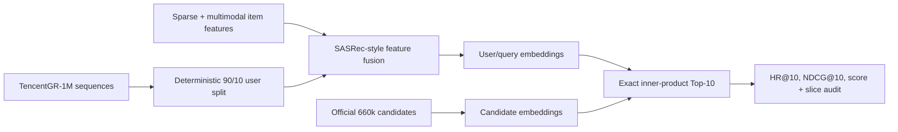

# TencentGR-1M 2025 Generative Recommendation Reproduction

[](https://github.com/yiyidaishui7/tencentgr-1m-2025-reproduction/actions/workflows/tests.yml)
[](LICENSE)
[](https://huggingface.co/sixteensun/tencentgr-1m-2025-reproduction)
[](https://huggingface.co/datasets/TAAC2025/TencentGR-1M)

[中文说明](README_CN.md) · [Delivery index](DELIVERY_INDEX.md) · [Detailed results](docs/RESULTS.md) · [Resource budget](docs/RESOURCE_BUDGET_CN.md) · [Resume kit](docs/RESUME.md) · [Model weights](https://huggingface.co/sixteensun/tencentgr-1m-2025-reproduction)

An independent, non-official reproduction of the 2025 Tencent Ads Algorithm
Competition baseline on TencentGR-1M. The project turns the official starting
point into an auditable end-to-end pipeline: deterministic training,
multimodal feature fusion, candidate encoding, exact Top-10 retrieval, offline
evaluation, ablation, SafeTensors publication, and verified artifact handling.

> This is a reproducible offline study, not an official competition submission
> or a claim of leaderboard placement.

## Advanced OnePiece reproduction

The repository contains a resource-scaled reproduction of
`shuoyang2/OnePiece@73e5102`. It starts with a controlled 4×128 HSTU versus
causal-Transformer comparison, scales HSTU to 8×256 and 8×512, and then adds a
frozen model-derived two-level semantic-ID auxiliary objective at the selected
8×512 scale. See the [experiment report](docs/ONEPIECE_REPRODUCTION_CN.md),
[capacity results](docs/ONEPIECE_SCALING_RESULTS.md),
[SID ablation](docs/ONEPIECE_SID_RESULTS.md),
[alignment results](docs/ONEPIECE_ALIGNMENT_RESULTS.md),
[path-neutral runbook](docs/ONEPIECE_RUNBOOK.md), and
[interview Q&A](docs/ONEPIECE_INTERVIEW_CN.md).

| Variant | Parameters | HR@10 | NDCG@10 | Score | Train time |
|---|---:|---:|---:|---:|---:|
| HSTU 4×128 | 491,793,216 | 0.0977433 | 0.0522325 | 0.0663408 | 78.6 min |
| HSTU 8×256 | 793,326,288 | 0.1112251 | 0.0602908 | 0.0760805 | 118.6 min |
| **HSTU 8×512** | 1,402,098,128 | **0.1208170** | **0.0665108** | **0.0833458** | 180.8 min |
| HSTU 8×512 + old SID | 1,423,127,274 | 0.1145576 | 0.0622381 | 0.0784571 | 225.5 min |
| **HSTU 8×512 + collision-free SID (0.02)** | 1,423,127,274 | 0.1207663 | **0.0666985** | **0.0834596** | 226.7 min |
| HSTU 8×512 + collision-free SID (0.05) | 1,423,127,274 | 0.1199427 | 0.0660450 | 0.0827533 | 240.2 min |

Scaling from 4×128 to 8×512 raises the fixed-seed score by 25.63%. The first
colliding, unweighted SID ablation regressed 5.87%; collision-free IDs plus a
0.02 linearly warmed auxiliary weight recover that regression and finish 0.14%
above no SID, with a paired interval that crosses zero. Every comparison uses
the same 78,921 row-aligned users and exact 660k-candidate Top-10 protocol.

## Results at a glance

| Variant | maxlen | MM | HR@10 | NDCG@10 | Score | Final BCE |
|---|---:|---|---:|---:|---:|---:|
| MM101 | 101 | on | 0.0313478 | 0.0159694 | 0.0207367 | 0.2043 |
| no-MM101 | 101 | off | 0.0317533 | 0.0165208 | 0.0212429 | **0.2040** |
| MM50 | 50 | on | 0.0320827 | 0.0160503 | 0.0210203 | 0.2061 |
| **no-MM50** | 50 | off | **0.0337046** | **0.0172092** | **0.0223228** | 0.2055 |

The evaluation uses a seeded 90/10 user split and holds out the last click from
each validation sequence. Histories contain only earlier events, and retrieval
runs against the official 660k candidate pool. See [the full evaluation
contract and slices](docs/RESULTS.md).

All four prediction files contain the same users, targets, and original
history lengths row by row. no-MM50 is the best fixed-seed point estimate:
`+7.65%` versus MM101, `+5.08%` versus no-MM101, and `+6.20%` versus MM50.
The latter two paired score intervals are positive for this evaluation
population, but every configuration has only one training seed. The overall
2x2 interaction interval includes zero, so the study does not establish a
stable causal interaction or that multimodal information is generally
harmful. The largest gain is concentrated in the 81+ history slice, which
contains 63.47% of evaluated users.

Two purpose-specific SafeTensors checkpoints are public: `model.safetensors`
is the audited MM101 baseline; `model_nomm50.safetensors` is the best
fixed-seed point estimate and must be loaded with `--maxlen 50
--disable_mm_emb`. Their configurations are not interchangeable.

## System overview



## What was engineered beyond the baseline

- Replaced hard-coded accelerator and filesystem assumptions with portable
  CPU/CUDA/Ascend device and path handling.
- Added deterministic user splitting, seeded data loading, bounded smoke runs,
  checkpoint resume, and a no-multimodal-feature ablation.
- Audited public/legacy candidate schemas and normalized item IDs across
  sequence, feature, multimodal, candidate, and retrieval files.
- Added a PyTorch exact inner-product Top-10 backend so evaluation does not
  depend on a machine-specific Faiss executable.
- Implemented a leakage-aware last-click offline evaluator with aggregate and
  history-length slice metrics.
- Added SafeTensors loading and published 48-tensor MM101 and 46-tensor no-MM50
  checkpoints, each verified tensor-by-tensor against its evaluated PyTorch
  state dict.
- Added regression tests for device routing, candidate decoding, binary ANN
  I/O, holdout construction, and competition metric weighting.
- Added a review-only 2x2 plan generator that freezes the four argv lists,
  private output roots, checkpoint globs, and comparison inputs as JSON without
  starting a GPU process.

## Reproduce

### 1. Install

```bash
python -m venv .venv
source .venv/bin/activate  # Windows: .venv\Scripts\activate
pip install -r requirements.txt
```

For Ascend environments, keep the image-matched `torch`/`torch_npu` pair and
use `requirements-npu.txt` for the remaining packages.

### 2. Download and validate data

```bash
python scripts/download_tencentgr_1m.py /data/TencentGR-1M
python scripts/validate_tencentgr_1m.py /data/TencentGR-1M
python scripts/audit_id_alignment.py /data/TencentGR-1M
```

The raw 137 GB dataset is not mirrored in this repository. Use the
[official TencentGR-1M repository](https://huggingface.co/datasets/TAAC2025/TencentGR-1M).

### 3. Train

Generate and review the exact four-way plan first:

```bash
python scripts/plan_2x2_experiments.py \
  --data-path /data/TencentGR-1M \
  --device cuda:0 \
  --output ./plans/seed2025_2x2.json
```

The planner never starts training. It makes parameter drift visible before the
commands are handed to a local or cluster scheduler.

```bash
python main.py \
  --data_path /data/TencentGR-1M \
  --device cuda:0 \
  --output_dir ./outputs \
  --seed 2025 \
  --maxlen 50 \
  --disable_mm_emb
```

The command above trains the no-MM50 best-point-estimate configuration. Remove
the final two flags for the MM101 baseline. Short smoke runs can use
`--max_train_steps` and `--max_valid_steps`.

### 4. Download a published checkpoint

```bash
pip install -U huggingface_hub
hf download sixteensun/tencentgr-1m-2025-reproduction model_nomm50.safetensors \
  --local-dir ./weights
```

### 5. Evaluate Top-10 retrieval

```bash
python offline_eval.py \
  --data_path /data/TencentGR-1M \
  --checkpoint ./weights/model_nomm50.safetensors \
  --output_dir ./offline_eval \
  --scratch_dir ./offline_eval_scratch \
  --device cuda:0 \
  --maxlen 50 \
  --disable_mm_emb
```

## Repository layout

```text
├── main.py / model.py / dataset.py    # training and model
├── infer.py / eval.py                 # candidate encoding and retrieval
├── offline_eval.py                    # audited last-click evaluation
├── candidate_utils.py                 # schema and ID normalization
├── comparison_utils.py                # paired 2x2 and history-slice statistics
├── experiment_plan.py                 # drift-resistant four-variant command plan
├── runtime_utils.py                   # device, seed, checkpoint portability
├── scripts/                           # download, audits, and four-way comparison CLI
├── configs/ + patches/                # controlled OnePiece configs and upstream runtime patch
├── tests/                             # regression tests
├── metrics/offline_metrics*.json      # machine-readable metrics for four variants
├── metrics/four_way_comparison.json   # alignment, slices, deltas, interaction
├── metrics/onepiece_architecture_comparison.json # controlled encoder audit
├── metrics/onepiece_scaling_comparison.json      # 4×128 / 8×256 / 8×512
├── metrics/onepiece_sid_comparison.json          # matched SID ablation
└── docs/                              # results and resume-ready material
```

## Verification

```bash
python -m unittest discover -s tests -v
python -m compileall -q .
```

The published model file has SHA-256
`1d53197a6c09fca20ad1c24d702a92a58adfc972f77f7236be3283d065db859b`.

## Attribution and license

This work is derived from the
[official 2025 Tencent Ads baseline](https://github.com/TencentAdvertisingAlgorithmCompetition/baseline_2025),
licensed under CC BY-NC 4.0. TencentGR-1M is published by TAAC2025 under
CC BY 4.0. This repository therefore uses CC BY-NC 4.0 and is restricted to
non-commercial use. See [ATTRIBUTION.md](ATTRIBUTION.md) and [LICENSE](LICENSE).
