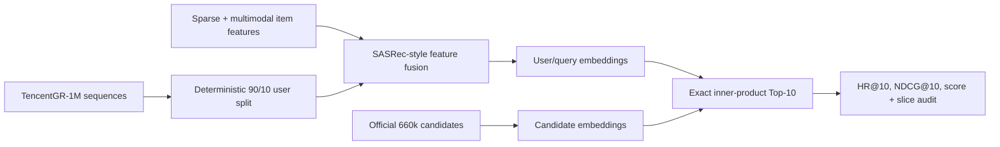

# TencentGR-1M 2025 Generative Recommendation Reproduction

[](https://github.com/yiyidaishui7/tencentgr-1m-2025-reproduction/actions/workflows/tests.yml)
[](LICENSE)
[](https://huggingface.co/sixteensun/tencentgr-1m-2025-reproduction)
[](https://huggingface.co/datasets/TAAC2025/TencentGR-1M)

[中文说明](README_CN.md) · [Project portfolio](docs/PROJECT_PORTFOLIO_CN.md) · [Plain-language guide (中文)](docs/PROJECT_EXPLAINED_CN.md) · [Interview deck](docs/INTERVIEW_DECK_CN.md) · [Delivery index](DELIVERY_INDEX.md) · [Known limitations](docs/KNOWN_LIMITATIONS_CN.md) · [Model weights](https://huggingface.co/sixteensun/tencentgr-1m-2025-reproduction)

An independent, non-official reproduction of the 2025 Tencent Ads Algorithm
Competition baseline on TencentGR-1M. The project turns the official starting
point into an auditable end-to-end pipeline: deterministic training,
multimodal feature fusion, candidate encoding, exact Top-10 retrieval, offline
evaluation, ablation, SafeTensors publication, and verified artifact handling.

> This is a reproducible offline study, not an official competition submission
> or a claim of leaderboard placement.

## Advanced OnePiece reproduction

The repository contains a resource-scaled reproduction of
`shuoyang2/OnePiece@73e5102`. It starts with a controlled 4×128 HSTU versus
causal-Transformer comparison, scales HSTU to 8×256 and 8×512, and then adds a
frozen model-derived two-level semantic-ID auxiliary objective at the selected
8×512 scale. See the [experiment report](docs/ONEPIECE_REPRODUCTION_CN.md),
[capacity results](docs/ONEPIECE_SCALING_RESULTS.md),
[SID ablation](docs/ONEPIECE_SID_RESULTS.md),
[alignment results](docs/ONEPIECE_ALIGNMENT_RESULTS.md),
[path-neutral runbook](docs/ONEPIECE_RUNBOOK.md), and
[interview Q&A](docs/ONEPIECE_INTERVIEW_CN.md).

| Variant | Parameters | HR@10 | NDCG@10 | Score | Train time |
|---|---:|---:|---:|---:|---:|
| HSTU 4×128 | 491,793,216 | 0.0977433 | 0.0522325 | 0.0663408 | 78.6 min |
| HSTU 8×256 | 793,326,288 | 0.1112251 | 0.0602908 | 0.0760805 | 118.6 min |
| **HSTU 8×512** | 1,402,098,128 | **0.1208170** | **0.0665108** | **0.0833458** | 180.8 min |
| HSTU 8×512 + old SID | 1,423,127,274 | 0.1145576 | 0.0622381 | 0.0784571 | 225.5 min |
| **HSTU 8×512 + collision-free SID (0.02)** | 1,423,127,274 | 0.1207663 | **0.0666985** | **0.0834596** | 226.7 min |
| HSTU 8×512 + collision-free SID (0.05) | 1,423,127,274 | 0.1199427 | 0.0660450 | 0.0827533 | 240.2 min |

These six rows remain the verified historical-protocol scores: the 660k pool
includes 148,971 cold candidates and user history was not filtered. The
archived SID mapping is a zero-collision global-residual approximation, not a
strict within-L1 implementation of the OnePiece README.

The 2026-09-07 historical release published two follow-up comparisons separately,
without rewriting that historical table:

| Follow-up | Evaluation protocol | Score | Delta vs historical `s8512` | Normal 95% interval |
|---|---|---:|---:|---:|
| Post-cutoff exposure mask (`xm512`) | historical 660k candidates; no history filtering | 0.0828782 | -0.0004676 (-0.56%) | [-0.0013758, 0.0004406] |
| Aligned control (same `s8512` checkpoint) | 511,029 warm candidates; history filtering | 0.0855212 | +0.0021755 (+2.61%) | [0.0019130, 0.0024380] |

The post-cutoff interval crosses zero. The aligned-control difference comes from
changing the evaluation protocol for the same checkpoint, so this is **not a model improvement**.
That release did not contain a complete 2x2: `xm512` had not been re-evaluated
under the aligned protocol, and the SID variants had not been re-evaluated. No Beam
path was used; the aligned receipt records `beam_eval=false` and
`beam_ann_fallback=false`. See the [alignment report](docs/ONEPIECE_ALIGNMENT_RESULTS.md)
and the machine-readable [mask](metrics/onepiece_post_cutoff_mask_comparison.json)
and [aligned-control](metrics/onepiece_aligned_control_comparison.json) comparisons.

Scaling from 4×128 to 8×512 raises the fixed-seed score by 25.63%. The first
colliding, unweighted SID ablation regressed 5.87%; collision-free IDs plus a
0.02 linearly warmed auxiliary weight recover that regression and finish 0.14%
above no SID, with a paired interval that crosses zero. These historical scaling
and SID comparisons use the same 78,921 row-aligned users and exact
660k-candidate Top-10 protocol.

### 2026-09-08 aligned-evaluation supplement

Three additional evaluations of existing checkpoints complete the control/mask
× historical/aligned 2×2 and add aligned SID weights 0.02/0.05; no model was
retrained. All eight artifacts share 78,921 row-aligned users. The aligned
protocol excludes 148,971 cold candidates from the original 660,000 and filters
user history over the remaining 511,029 candidates.

<!-- AUTO-GENERATED values from metrics/onepiece_followup_comparison.json -->
| Existing checkpoint | Historical score | Aligned score |
|---|---:|---:|
| Control (`s8512`) | 0.0833458 | 0.0855212 |
| Post-cutoff mask (`xm512`) | 0.0828782 | 0.0848123 |
| Collision-free SID (0.02) | 0.0834596 | 0.0851821 |
| Collision-free SID (0.05) | 0.0827533 | 0.0849867 |

| Aligned comparison | Overall score delta | Paired normal 95% interval |
|---|---:|---:|
| Mask − control | -0.0007089 | [-0.0016229, 0.0002051] |
| SID 0.02 − control | -0.0003391 | [-0.0012484, 0.0005701] |
| SID 0.05 − control | -0.0005345 | [-0.0014464, 0.0003774] |
| Mask × protocol interaction | -0.0002413 | [-0.0005553, 0.0000726] |
<!-- END AUTO-GENERATED values -->

The control has the highest aligned point estimate, but all four overall score intervals above
cross zero: they establish neither a stable model gain/loss nor an interaction.
All four same-checkpoint overall score protocol effects have positive intervals; these remain
**evaluation-protocol effects, not model improvements**. This supplement compares
exact full-candidate Top-10 only, not Beam outputs. It uses one training seed and unadjusted paired
per-user intervals, which do not measure training-seed variance. See the
[full results and reproduction CLI](docs/ONEPIECE_ALIGNMENT_RESULTS.md),
[strict comparison JSON](metrics/onepiece_followup_comparison.json), and
[`compare_onepiece_followup.py`](scripts/compare_onepiece_followup.py).

## Historical baseline results

> **Contract notice (2026-09):** an audit found that the archived Baseline
> training path inserted one user token per event, while evaluation
> inserted one per sequence. The code and a regression test are fixed, but the
> 2×2 has not yet been retrained. The table is retained only for artifact
> lineage; its max-length and multimodal-effect interpretations are withdrawn.
> The separate OnePiece pipeline and results above are unaffected.

| Variant | maxlen | MM | HR@10 | NDCG@10 | Score | Final BCE |
|---|---:|---|---:|---:|---:|---:|
| MM101 | 101 | on | 0.0313478 | 0.0159694 | 0.0207367 | 0.2043 |
| no-MM101 | 101 | off | 0.0317533 | 0.0165208 | 0.0212429 | **0.2040** |
| MM50 | 50 | on | 0.0320827 | 0.0160503 | 0.0210203 | 0.2061 |
| no-MM50 | 50 | off | 0.0337046 | 0.0172092 | 0.0223228 | 0.2055 |

The evaluation uses a seeded 90/10 user split and holds out the last click from
each validation sequence. Histories contain only earlier events, and retrieval
runs against the official 660k candidate pool. See [the full evaluation
contract and slices](docs/RESULTS.md).

All four prediction files remain row-aligned and the point estimates are
reproducible from their archived artifacts. They must not be used to claim a
max-length effect, a multimodal-feature effect, or a best configuration until
the corrected training contract is rerun.

Two purpose-specific historical SafeTensors checkpoints remain public for
artifact verification: `model.safetensors` is MM101 and
`model_nomm50.safetensors` is no-MM50. The latter must be loaded with
`--maxlen 50 --disable_mm_emb`; neither checkpoint is evidence for the
withdrawn 2×2 interpretation.

## System overview



## What was engineered beyond the baseline

- Replaced hard-coded accelerator and filesystem assumptions with portable
  CPU/CUDA/Ascend device and path handling.
- Added deterministic user splitting, seeded data loading, bounded smoke runs,
  checkpoint resume, and a no-multimodal-feature ablation.
- Audited public/legacy candidate schemas and normalized item IDs across
  sequence, feature, multimodal, candidate, and retrieval files.
- Added a PyTorch exact inner-product Top-10 backend so evaluation does not
  depend on a machine-specific Faiss executable.
- Implemented a leakage-aware last-click offline evaluator with aggregate and
  history-length slice metrics.
- Added SafeTensors loading and published 48-tensor MM101 and 46-tensor no-MM50
  checkpoints, each verified tensor-by-tensor against its evaluated PyTorch
  state dict.
- Added regression tests for device routing, candidate decoding, binary ANN
  I/O, holdout construction, and competition metric weighting.
- Added a review-only 2x2 plan generator that freezes the four argv lists,
  private output roots, checkpoint globs, and comparison inputs as JSON without
  starting a GPU process.

## Reproduce

### 1. Install

```bash
python -m venv .venv
source .venv/bin/activate  # Windows: .venv\Scripts\activate
pip install -r requirements.txt
```

For Ascend environments, keep the image-matched `torch`/`torch_npu` pair and
use `requirements-npu.txt` for the remaining packages.

### 2. Download and validate data

```bash
python scripts/download_tencentgr_1m.py /data/TencentGR-1M
python scripts/validate_tencentgr_1m.py /data/TencentGR-1M
python scripts/audit_id_alignment.py /data/TencentGR-1M
```

The raw 137 GB dataset is not mirrored in this repository. Use the
[official TencentGR-1M repository](https://huggingface.co/datasets/TAAC2025/TencentGR-1M).

### 3. Train

Generate and review the exact four-way plan first:

```bash
python scripts/plan_2x2_experiments.py \
  --data-path /data/TencentGR-1M \
  --device cuda:0 \
  --output ./plans/seed2025_2x2.json
```

The planner never starts training. It makes parameter drift visible before the
commands are handed to a local or cluster scheduler.

```bash
python main.py \
  --data_path /data/TencentGR-1M \
  --device cuda:0 \
  --output_dir ./outputs \
  --seed 2025 \
  --maxlen 50 \
  --disable_mm_emb
```

The command above trains the corrected no-MM50 configuration. Remove the final
two flags for MM101. Do not compare new runs with the archived table as if the
training contracts were identical. Short smoke runs can use
`--max_train_steps` and `--max_valid_steps`.

### 4. Download a published checkpoint

```bash
pip install -U huggingface_hub
hf download sixteensun/tencentgr-1m-2025-reproduction model_nomm50.safetensors \
  --local-dir ./weights
```

### 5. Evaluate Top-10 retrieval

```bash
python offline_eval.py \
  --data_path /data/TencentGR-1M \
  --checkpoint ./weights/model_nomm50.safetensors \
  --output_dir ./offline_eval \
  --scratch_dir ./offline_eval_scratch \
  --device cuda:0 \
  --maxlen 50 \
  --disable_mm_emb
```

## Repository layout

```text
├── main.py / model.py / dataset.py    # training and model
├── infer.py / eval.py                 # candidate encoding and retrieval
├── offline_eval.py                    # audited last-click evaluation
├── candidate_utils.py                 # schema and ID normalization
├── comparison_utils.py                # paired 2x2 and history-slice statistics
├── experiment_plan.py                 # drift-resistant four-variant command plan
├── runtime_utils.py                   # device, seed, checkpoint portability
├── scripts/                           # download, audits, and four-way comparison CLI
├── configs/                           # controlled OnePiece configs
├── docs/ONEPIECE_RUNBOOK.md           # source contract and manual interoperability edits
├── tests/                             # regression tests
├── metrics/offline_metrics*.json      # machine-readable metrics for four variants
├── metrics/four_way_comparison.json   # alignment, slices, deltas, interaction
├── metrics/onepiece_architecture_comparison.json # controlled encoder audit
├── metrics/onepiece_scaling_comparison.json      # 4×128 / 8×256 / 8×512
├── metrics/onepiece_sid_comparison.json          # matched SID ablation
├── metrics/onepiece_post_cutoff_mask_comparison.json # exposure-mask comparison
├── metrics/onepiece_aligned_control_comparison.json  # same-checkpoint protocol audit
├── metrics/onepiece_followup_comparison.json         # full mask × protocol 2×2 and aligned SID
└── docs/                              # results and resume-ready material
```

## Verification

```bash
python -m pip install -r requirements.txt -r requirements-dev.txt
python -m pytest -q
python -m compileall -q .
```

On Ascend, preserve the image-matched `torch`/`torch_npu` pair and install
`-r requirements-npu.txt -r requirements-dev.txt` instead.

The published model file has SHA-256
`1d53197a6c09fca20ad1c24d702a92a58adfc972f77f7236be3283d065db859b`.

## Security note

Load `pickle`, legacy `.pt`, and resume artifacts only from trusted sources;
deserialization happens before every semantic check can run. Prefer
SafeTensors plus a verified SHA-256 for public model exchange.

## Attribution and license

This work is derived from the
[official 2025 Tencent Ads baseline](https://github.com/TencentAdvertisingAlgorithmCompetition/baseline_2025),
licensed under CC BY-NC 4.0. TencentGR-1M is published by TAAC2025 under
CC BY 4.0. This repository therefore uses CC BY-NC 4.0 and is restricted to
non-commercial use. See [ATTRIBUTION.md](ATTRIBUTION.md) and [LICENSE](LICENSE).
That repository license grants no rights to upstream OnePiece material. The
current tree does not redistribute OnePiece source or a derivative patch; see
[known limitations](docs/KNOWN_LIMITATIONS_CN.md#3-许可与来源).
