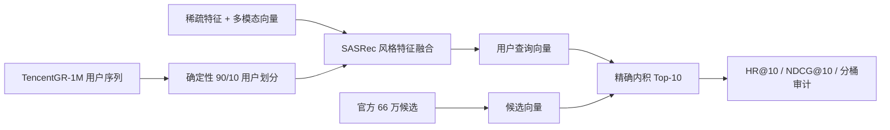

# TencentGR-1M 2025 全模态生成式推荐复现

[English](README.md) · [最终交付索引](DELIVERY_INDEX.md) · [完整实验结果](docs/RESULTS.md) · [简历与面试材料](docs/RESUME.md) · [模型权重](https://huggingface.co/sixteensun/tencentgr-1m-2025-reproduction)

本项目基于 2025 腾讯广告算法大赛官方 Baseline，在公开的
TencentGR-1M 数据集上完成独立、非官方的端到端复现。项目覆盖确定性训练、
多模态特征融合、候选编码、精确 Top-10 召回、离线评估、消融实验、
SafeTensors 发布和产物校验。

> 本项目展示的是可复现离线实验，不是官方参赛提交，也不宣称任何比赛名次。

## 核心结果

| 变体 | maxlen | 多模态 | HR@10 | NDCG@10 | 综合分 | 最终 BCE |
|---|---:|---|---:|---:|---:|---:|
| MM101 | 101 | 开启 | 0.0313478 | 0.0159694 | 0.0207367 | 0.2043 |
| no-MM101 | 101 | 关闭 | 0.0317533 | 0.0165208 | 0.0212429 | **0.2040** |
| MM50 | 50 | 开启 | 0.0320827 | 0.0160503 | 0.0210203 | 0.2061 |
| **no-MM50** | 50 | 关闭 | **0.0337046** | **0.0172092** | **0.0223228** | 0.2055 |

离线协议采用固定随机种子的 90/10 用户划分，对验证用户保留最后一次点击，
历史序列只包含目标点击之前的事件，并在官方约 66 万候选集合上进行 Top-10
检索。详细审计与分桶结果见 [docs/RESULTS.md](docs/RESULTS.md)。

四组预测的用户、目标和原始历史长度逐行一致。no-MM50 是固定 seed 下的最佳
点估计：相对 MM101、no-MM101、MM50 的综合分分别提高 7.65%、5.08%、
6.20%。后两条差值在本次评测人口上的配对区间为正，但每个配置只训练了一个
seed，且整体 2×2 交互项区间仍跨过 0，因此不能声称存在稳定因果交互，也不能
声称多模态信息普遍无效。主要收益集中在占评测人口 63.47% 的 81+ 长历史组。

## 架构



## 相比官方 Baseline 的工程扩展

- 移除硬编码设备和文件路径，支持 CPU、CUDA 与 Ascend NPU 环境。
- 增加固定随机种子、确定性用户划分、短程 smoke test、断点恢复和关闭多模态
  特征的消融实验。
- 审计公开版与旧版候选数据结构，统一序列、特征、多模态、候选与召回文件的
  item ID 映射。
- 增加 PyTorch 精确内积 Top-10 后端，摆脱机器专用 Faiss 可执行文件依赖。
- 实现防泄漏的最后点击留出评估，并输出整体及历史长度分桶指标。
- 支持 SafeTensors，发布的 48 个张量已与正式评估使用的 `.pt` 权重逐项验证一致。
- 为设备路由、候选解析、ANN 二进制格式、留出逻辑和指标计算增加回归测试。

## 快速复现

```bash
pip install -r requirements.txt

python scripts/download_tencentgr_1m.py /data/TencentGR-1M
python scripts/validate_tencentgr_1m.py /data/TencentGR-1M
python scripts/audit_id_alignment.py /data/TencentGR-1M

python main.py \
  --data_path /data/TencentGR-1M \
  --device cuda:0 \
  --output_dir ./outputs \
  --seed 2025

hf download sixteensun/tencentgr-1m-2025-reproduction model.safetensors \
  --local-dir ./weights

python offline_eval.py \
  --data_path /data/TencentGR-1M \
  --checkpoint ./weights/model.safetensors \
  --output_dir ./offline_eval \
  --scratch_dir ./offline_eval_scratch \
  --device cuda:0
```

原始数据不在本仓库重复发布，请从
[TAAC2025/TencentGR-1M](https://huggingface.co/datasets/TAAC2025/TencentGR-1M)
获取。关闭多模态特征的消融实验使用 `--disable_mm_emb`。

## 验证

```bash
python -m unittest discover -s tests -v
python -m compileall -q .
```

## 许可

官方 Baseline 使用 CC BY-NC 4.0，TencentGR-1M 数据集使用 CC BY 4.0。
本项目沿用更严格的 CC BY-NC 4.0，仅限非商业用途，并在
[ATTRIBUTION.md](ATTRIBUTION.md) 中保留完整署名。
