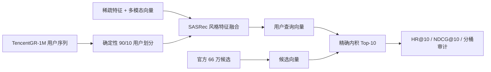

# TencentGR-1M 2025 全模态生成式推荐复现

[English](README.md) · [最终交付索引](DELIVERY_INDEX.md) · [完整实验结果](docs/RESULTS.md) · [资源预算](docs/RESOURCE_BUDGET_CN.md) · [简历与面试材料](docs/RESUME.md) · [模型权重](https://huggingface.co/sixteensun/tencentgr-1m-2025-reproduction)

本项目基于 2025 腾讯广告算法大赛官方 Baseline，在公开的
TencentGR-1M 数据集上完成独立、非官方的端到端复现。项目覆盖确定性训练、
多模态特征融合、候选编码、精确 Top-10 召回、离线评估、消融实验、
SafeTensors 发布和产物校验。

> 本项目展示的是可复现离线实验，不是官方参赛提交，也不宣称任何比赛名次。

## OnePiece 进阶复现

仓库同时包含 `shuoyang2/OnePiece@73e5102` 的资源缩放复现：先完成 4×128 HSTU
与同配置因果 Transformer 的架构对照，再将 HSTU 扩展到 8×256、8×512，并在选中的
8×512 上加入冻结的模型派生两级语义 ID 辅助目标。参见
[实验说明](docs/ONEPIECE_REPRODUCTION_CN.md)、
[容量扩展结果](docs/ONEPIECE_SCALING_RESULTS.md)、
[SID 消融](docs/ONEPIECE_SID_RESULTS.md)、
[对齐结果](docs/ONEPIECE_ALIGNMENT_RESULTS.md)、
[无私有路径运行手册](docs/ONEPIECE_RUNBOOK.md) 和
[专项面试问答](docs/ONEPIECE_INTERVIEW_CN.md)。全部正式运行均通过清单哈希、
78,921 行冻结协议对齐和指标重算。

| 变体 | 参数量 | HR@10 | NDCG@10 | 综合分 | 训练耗时 |
|---|---:|---:|---:|---:|---:|
| HSTU 4×128 | 491,793,216 | 0.0977433 | 0.0522325 | 0.0663408 | 78.6 min |
| HSTU 8×256 | 793,326,288 | 0.1112251 | 0.0602908 | 0.0760805 | 118.6 min |
| **HSTU 8×512** | 1,402,098,128 | **0.1208170** | **0.0665108** | **0.0833458** | 180.8 min |
| HSTU 8×512 + 旧 SID | 1,423,127,274 | 0.1145576 | 0.0622381 | 0.0784571 | 225.5 min |
| **HSTU 8×512 + 无冲突 SID (0.02)** | 1,423,127,274 | 0.1207663 | **0.0666985** | **0.0834596** | 226.7 min |
| HSTU 8×512 + 无冲突 SID (0.05) | 1,423,127,274 | 0.1199427 | 0.0660450 | 0.0827533 | 240.2 min |

4×128 扩展到 8×512 后固定 seed 综合分提高 25.63%。第一轮碰撞、未加权 SID 消融
下降 5.87%；零碰撞映射、线性 warm-up 和 0.02 权重将退化修复到与无 SID 基本持平，
点估计 +0.14%，但配对区间跨 0，不能声称稳定提升。

## 核心结果

| 变体 | maxlen | 多模态 | HR@10 | NDCG@10 | 综合分 | 最终 BCE |
|---|---:|---|---:|---:|---:|---:|
| MM101 | 101 | 开启 | 0.0313478 | 0.0159694 | 0.0207367 | 0.2043 |
| no-MM101 | 101 | 关闭 | 0.0317533 | 0.0165208 | 0.0212429 | **0.2040** |
| MM50 | 50 | 开启 | 0.0320827 | 0.0160503 | 0.0210203 | 0.2061 |
| **no-MM50** | 50 | 关闭 | **0.0337046** | **0.0172092** | **0.0223228** | 0.2055 |

离线协议采用固定随机种子的 90/10 用户划分，对验证用户保留最后一次点击，
历史序列只包含目标点击之前的事件，并在官方约 66 万候选集合上进行 Top-10
检索。详细审计与分桶结果见 [docs/RESULTS.md](docs/RESULTS.md)。

四组预测的用户、目标和原始历史长度逐行一致。no-MM50 是固定 seed 下的最佳
点估计：相对 MM101、no-MM101、MM50 的综合分分别提高 7.65%、5.08%、
6.20%。后两条差值在本次评测人口上的配对区间为正，但每个配置只训练了一个
seed，且整体 2×2 交互项区间仍跨过 0，因此不能声称存在稳定因果交互，也不能
声称多模态信息普遍无效。主要收益集中在占评测人口 63.47% 的 81+ 长历史组。

公开权重包含两个用途明确的 SafeTensors：`model.safetensors` 是 MM101 审计
基线；`model_nomm50.safetensors` 对应最佳固定 seed 点估计，加载时必须同时使用
`--maxlen 50 --disable_mm_emb`。二者不能混用配置。

## 架构



## 相比官方 Baseline 的工程扩展

- 移除硬编码设备和文件路径，支持 CPU、CUDA 与 Ascend NPU 环境。
- 增加固定随机种子、确定性用户划分、短程 smoke test、断点恢复和关闭多模态
  特征的消融实验。
- 审计公开版与旧版候选数据结构，统一序列、特征、多模态、候选与召回文件的
  item ID 映射。
- 增加 PyTorch 精确内积 Top-10 后端，摆脱机器专用 Faiss 可执行文件依赖。
- 实现防泄漏的最后点击留出评估，并输出整体及历史长度分桶指标。
- 支持 SafeTensors，发布 48 张量的 MM101 与 46 张量的 no-MM50 权重，二者均与
  各自正式评估使用的 `.pt` 权重逐项验证一致。
- 为设备路由、候选解析、ANN 二进制格式、留出逻辑和指标计算增加回归测试。
- 增加只生成、不启动训练的 2×2 计划器，把四组 argv、私有输出目录和比较输入固化
  为机器可读 JSON，避免人工改参数导致实验漂移。

## 快速复现

```bash
pip install -r requirements.txt

python scripts/download_tencentgr_1m.py /data/TencentGR-1M
python scripts/validate_tencentgr_1m.py /data/TencentGR-1M
python scripts/audit_id_alignment.py /data/TencentGR-1M

python scripts/plan_2x2_experiments.py \
  --data-path /data/TencentGR-1M \
  --device cuda:0 \
  --output ./plans/seed2025_2x2.json

python main.py \
  --data_path /data/TencentGR-1M \
  --device cuda:0 \
  --output_dir ./outputs \
  --seed 2025 \
  --maxlen 50 \
  --disable_mm_emb

hf download sixteensun/tencentgr-1m-2025-reproduction model_nomm50.safetensors \
  --local-dir ./weights

python offline_eval.py \
  --data_path /data/TencentGR-1M \
  --checkpoint ./weights/model_nomm50.safetensors \
  --output_dir ./offline_eval \
  --scratch_dir ./offline_eval_scratch \
  --device cuda:0 \
  --maxlen 50 \
  --disable_mm_emb
```

上面的训练和评测命令对应 no-MM50 最佳点估计；去掉最后两个配置参数即可运行
MM101 审计基线。

计划器只写命令清单，不会自行占用 GPU。完整四组执行规则和 checkpoint 选择说明见
[复现手册](docs/REPRODUCTION_RUNBOOK_CN.md)。

原始数据不在本仓库重复发布，请从
[TAAC2025/TencentGR-1M](https://huggingface.co/datasets/TAAC2025/TencentGR-1M)
获取。关闭多模态特征的消融实验使用 `--disable_mm_emb`。

## 验证

```bash
python -m unittest discover -s tests -v
python -m compileall -q .
```

## 许可

官方 Baseline 使用 CC BY-NC 4.0，TencentGR-1M 数据集使用 CC BY 4.0。
本项目沿用更严格的 CC BY-NC 4.0，仅限非商业用途，并在
[ATTRIBUTION.md](ATTRIBUTION.md) 中保留完整署名。
