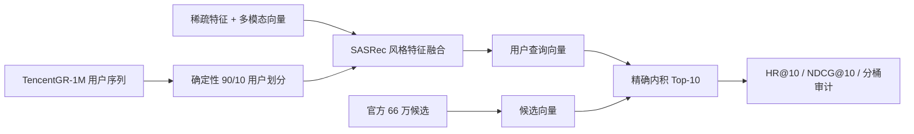

# TencentGR-1M 2025 全模态生成式推荐复现

[English](README.md) · [项目总览](docs/PROJECT_PORTFOLIO_CN.md) · [面试展示稿](docs/INTERVIEW_DECK_CN.md) · [最终交付索引](DELIVERY_INDEX.md) · [已知限制](docs/KNOWN_LIMITATIONS_CN.md) · [模型权重](https://huggingface.co/sixteensun/tencentgr-1m-2025-reproduction)

本项目基于 2025 腾讯广告算法大赛官方 Baseline，在公开的
TencentGR-1M 数据集上完成独立、非官方的端到端复现。项目覆盖确定性训练、
多模态特征融合、候选编码、精确 Top-10 召回、离线评估、消融实验、
SafeTensors 发布和产物校验。

> 本项目展示的是可复现离线实验，不是官方参赛提交，也不宣称任何比赛名次。

## OnePiece 进阶复现

仓库同时包含 `shuoyang2/OnePiece@73e5102` 的资源缩放复现：先完成 4×128 HSTU
与同配置因果 Transformer 的架构对照，再将 HSTU 扩展到 8×256、8×512，并在选中的
8×512 上加入冻结的模型派生两级语义 ID 辅助目标。参见
[实验说明](docs/ONEPIECE_REPRODUCTION_CN.md)、
[容量扩展结果](docs/ONEPIECE_SCALING_RESULTS.md)、
[SID 消融](docs/ONEPIECE_SID_RESULTS.md)、
[对齐结果](docs/ONEPIECE_ALIGNMENT_RESULTS.md)、
[无私有路径运行手册](docs/ONEPIECE_RUNBOOK.md) 和
[专项面试问答](docs/ONEPIECE_INTERVIEW_CN.md)。全部正式运行均通过清单哈希、
78,921 行冻结协议对齐和指标重算。

| 变体 | 参数量 | HR@10 | NDCG@10 | 综合分 | 训练耗时 |
|---|---:|---:|---:|---:|---:|
| HSTU 4×128 | 491,793,216 | 0.0977433 | 0.0522325 | 0.0663408 | 78.6 min |
| HSTU 8×256 | 793,326,288 | 0.1112251 | 0.0602908 | 0.0760805 | 118.6 min |
| **HSTU 8×512** | 1,402,098,128 | **0.1208170** | **0.0665108** | **0.0833458** | 180.8 min |
| HSTU 8×512 + 旧 SID | 1,423,127,274 | 0.1145576 | 0.0622381 | 0.0784571 | 225.5 min |
| **HSTU 8×512 + 无冲突 SID (0.02)** | 1,423,127,274 | 0.1207663 | **0.0666985** | **0.0834596** | 226.7 min |
| HSTU 8×512 + 无冲突 SID (0.05) | 1,423,127,274 | 0.1199427 | 0.0660450 | 0.0827533 | 240.2 min |

以上六行保留为已验真的历史协议分数：66 万候选中包含 148,971 个冷候选，
且未过滤用户历史。归档 SID 是全局 residual 的零碰撞近似，不是 OnePiece
README 所述的严格 L1 内 L2 实现。

2026-09-07 历史发布单独报告以下两项后续对照，不改写上述历史六行表：

| 后续对照 | 评测口径 | 综合分 | 相对历史 `s8512` | 正态近似 95% 区间 |
|---|---|---:|---:|---:|
| 截止时间后曝光掩码（`xm512`） | 历史 660k 候选；不过滤历史 | 0.0828782 | -0.0004676（-0.56%） | [-0.0013758, 0.0004406] |
| 对齐控制组（同一 `s8512` checkpoint） | 511,029 暖候选；过滤历史 | 0.0855212 | +0.0021755（+2.61%） | [0.0019130, 0.0024380] |

截止时间后掩码的区间跨 0。对齐控制组只是用同一 `s8512` checkpoint 更换评测口径，
因此 +2.61% **不是模型提升**。截至该次发布，尚未完成全部 2×2：`xm512` 当时未用
对齐口径重评，SID 变体也未重评。该次发布不走 Beam；对齐回执明确记录 `beam_eval=false` 和
`beam_ann_fallback=false`。详见[对齐结果](docs/ONEPIECE_ALIGNMENT_RESULTS.md)及机器可读的
[掩码对照](metrics/onepiece_post_cutoff_mask_comparison.json)和
[同 checkpoint 对齐对照](metrics/onepiece_aligned_control_comparison.json)。

4×128 扩展到 8×512 后固定 seed 综合分提高 25.63%。第一轮碰撞、未加权 SID 消融
下降 5.87%；零碰撞映射、线性 warm-up 和 0.02 权重将退化修复到与无 SID 基本持平，
点估计 +0.14%，但配对区间跨 0，不能声称稳定提升。

### 2026-09-08 对齐评测补充

新增三次既有 checkpoint 重评，补齐控制组/掩码 × 历史/对齐协议的完整 2×2，
并增加 SID 权重 0.02/0.05 的对齐评测，没有重新训练模型。八组产物共享逐行对齐的
78,921 个用户；对齐协议从原始 660,000 个候选中排除 148,971 个冷候选，在余下
511,029 个暖候选上过滤用户历史。

<!-- AUTO-GENERATED values from metrics/onepiece_followup_comparison.json -->
| 既有 checkpoint | 历史协议综合分 | 对齐协议综合分 |
|---|---:|---:|
| 控制组（`s8512`） | 0.0833458 | 0.0855212 |
| 截止时间后掩码（`xm512`） | 0.0828782 | 0.0848123 |
| 无冲突 SID（0.02） | 0.0834596 | 0.0851821 |
| 无冲突 SID（0.05） | 0.0827533 | 0.0849867 |

| 对齐协议对照 | 总体综合分差值 | 配对正态近似 95% 区间 |
|---|---:|---:|
| 掩码 − 控制组 | -0.0007089 | [-0.0016229, 0.0002051] |
| SID 0.02 − 控制组 | -0.0003391 | [-0.0012484, 0.0005701] |
| SID 0.05 − 控制组 | -0.0005345 | [-0.0014464, 0.0003774] |
| 掩码 × 协议交互项 | -0.0002413 | [-0.0005553, 0.0000726] |
<!-- END AUTO-GENERATED values -->

控制组的对齐点估计最高，但上述四个总体综合分区间均跨 0，不能声称稳定模型提升、退化或交互。
四组同 checkpoint 的总体综合分协议效应区间均为正，但仍是**评测协议效应，不是模型提升**。
本补充仅比较全候选精确 Top-10，不比较 Beam 结果；每组只有一个训练 seed，配对用户区间
未经多重比较调整，也不涵盖训练 seed 方差。完整结果与复算命令见
[对齐报告](docs/ONEPIECE_ALIGNMENT_RESULTS.md)、
[标准比较 JSON](metrics/onepiece_followup_comparison.json) 和
[`compare_onepiece_followup.py`](scripts/compare_onepiece_followup.py)。

## 历史 Baseline 结果

> **数据契约提示（2026-09）：** 审计发现，历史 Baseline 训练路径曾按事件重复插入
> 用户 token，而评测路径每条序列只插入一次。代码与回归测试已经修复，
> 但 2×2 尚未按新契约重训。下表仅用于产物追溯，原 maxlen 与多模态效应解释全部
> 撤回；上文独立 OnePiece 管线与指标不受影响。

| 变体 | maxlen | 多模态 | HR@10 | NDCG@10 | 综合分 | 最终 BCE |
|---|---:|---|---:|---:|---:|---:|
| MM101 | 101 | 开启 | 0.0313478 | 0.0159694 | 0.0207367 | 0.2043 |
| no-MM101 | 101 | 关闭 | 0.0317533 | 0.0165208 | 0.0212429 | **0.2040** |
| MM50 | 50 | 开启 | 0.0320827 | 0.0160503 | 0.0210203 | 0.2061 |
| no-MM50 | 50 | 关闭 | 0.0337046 | 0.0172092 | 0.0223228 | 0.2055 |

离线协议采用固定随机种子的 90/10 用户划分，对验证用户保留最后一次点击，
历史序列只包含目标点击之前的事件，并在官方约 66 万候选集合上进行 Top-10
检索。详细审计与分桶结果见 [docs/RESULTS.md](docs/RESULTS.md)。

四组预测仍保持用户、目标和原始历史长度逐行一致，归档产物也可复算点估计；
但在按修复后训练契约重跑前，不得据此声称窗口长度效应、多模态效应或最佳配置。

公开权重保留两个历史 SafeTensors 供产物校验：`model.safetensors` 对应 MM101，
`model_nomm50.safetensors` 对应 no-MM50，后者加载时必须同时使用
`--maxlen 50 --disable_mm_emb`。二者不能混用配置，也不能作为已撤回 2×2 解释的证据。

## 架构



## 相比官方 Baseline 的工程扩展

- 移除硬编码设备和文件路径，支持 CPU、CUDA 与 Ascend NPU 环境。
- 增加固定随机种子、确定性用户划分、短程 smoke test、断点恢复和关闭多模态
  特征的消融实验。
- 审计公开版与旧版候选数据结构，统一序列、特征、多模态、候选与召回文件的
  item ID 映射。
- 增加 PyTorch 精确内积 Top-10 后端，摆脱机器专用 Faiss 可执行文件依赖。
- 实现防泄漏的最后点击留出评估，并输出整体及历史长度分桶指标。
- 支持 SafeTensors，发布 48 张量的 MM101 与 46 张量的 no-MM50 权重，二者均与
  各自正式评估使用的 `.pt` 权重逐项验证一致。
- 为设备路由、候选解析、ANN 二进制格式、留出逻辑和指标计算增加回归测试。
- 增加只生成、不启动训练的 2×2 计划器，把四组 argv、私有输出目录和比较输入固化
  为机器可读 JSON，避免人工改参数导致实验漂移。

## 快速复现

CPU/CUDA 环境先安装标准依赖：

```bash
pip install -r requirements.txt
```

Ascend 环境应保留镜像匹配的 `torch`/`torch_npu`，改用：

```bash
pip install -r requirements-npu.txt
```

随后执行数据审计、计划、训练与评测：

```bash
python scripts/download_tencentgr_1m.py /data/TencentGR-1M
python scripts/validate_tencentgr_1m.py /data/TencentGR-1M
python scripts/audit_id_alignment.py /data/TencentGR-1M

python scripts/plan_2x2_experiments.py \
  --data-path /data/TencentGR-1M \
  --device cuda:0 \
  --output ./plans/seed2025_2x2.json

python main.py \
  --data_path /data/TencentGR-1M \
  --device cuda:0 \
  --output_dir ./outputs \
  --seed 2025 \
  --maxlen 50 \
  --disable_mm_emb

hf download sixteensun/tencentgr-1m-2025-reproduction model_nomm50.safetensors \
  --local-dir ./weights

python offline_eval.py \
  --data_path /data/TencentGR-1M \
  --checkpoint ./weights/model_nomm50.safetensors \
  --output_dir ./offline_eval \
  --scratch_dir ./offline_eval_scratch \
  --device cuda:0 \
  --maxlen 50 \
  --disable_mm_emb
```

上面的训练命令使用修复后的 no-MM50 数据契约；去掉最后两个配置参数即可运行
MM101。不要把新训练结果与历史表格当作同一训练契约直接比较。

计划器只写命令清单，不会自行占用 GPU。完整四组执行规则和 checkpoint 选择说明见
[复现手册](docs/REPRODUCTION_RUNBOOK_CN.md)。

原始数据不在本仓库重复发布，请从
[TAAC2025/TencentGR-1M](https://huggingface.co/datasets/TAAC2025/TencentGR-1M)
获取。关闭多模态特征的消融实验使用 `--disable_mm_emb`。

## 验证

```bash
python -m pip install -r requirements.txt -r requirements-dev.txt
python -m pytest -q
python -m compileall -q .
```

Ascend 环境应保留镜像匹配的 `torch`/`torch_npu`，改为安装
`-r requirements-npu.txt -r requirements-dev.txt`，不要覆盖通用 PyPI `torch`。

## 安全提示

只从可信来源加载 `pickle`、旧式 `.pt` 和断点文件；反序列化可能早于完整语义校验。
公开交换模型时优先使用 SafeTensors，并核验 SHA-256。

## 许可

官方 Baseline 使用 CC BY-NC 4.0，TencentGR-1M 数据集使用 CC BY 4.0。
本项目沿用更严格的 CC BY-NC 4.0，仅限非商业用途，并在
[ATTRIBUTION.md](ATTRIBUTION.md) 中保留完整署名。
该仓库许可不授予任何 OnePiece 上游材料权利；当前树不再分发其源码或衍生补丁，
详情见[已知限制](docs/KNOWN_LIMITATIONS_CN.md#3-许可与来源)。
