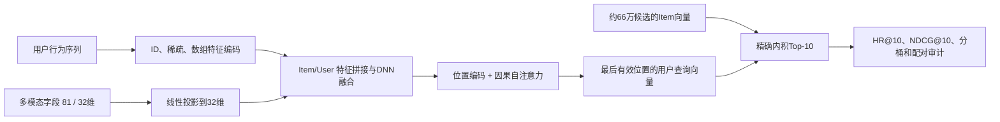

# 架构与实验设计

## 1. 项目边界

本项目复现的是 2025 腾讯广告算法大赛 TencentGR-1M 官方 Baseline 所代表的端到端推荐链路：序列构造、特征融合、训练、候选编码、Top-10 检索和离线评估。它不是官方提交，也不把离线综合分描述为榜单分数。

> 2026-09-12 审计发现，历史 Baseline 训练路径会为同一用户重复插入 user token，而离线评测只插入一次。四组 maxlen/MM 指标保留用于追溯，但在统一数据契约并重新训练前，只能视为历史探索性结果。OnePiece 独立数据管线不受该问题影响。

## 2. 数据与评测人口

- 原始序列：1,001,845 名用户。
- Item 索引规模：4,783,154。
- 验证集：固定 seed 2025 的 90/10 用户划分，共 100,184 名验证用户。
- 留出目标：每名验证用户最后一个 `action_type=1` 的 Item。
- 防泄漏历史：只保留目标点击之前的行为。
- 官方候选集合：约 66 万个候选，而不是完整 Item 空间。
- 排除规则：无点击目标，或目标不在候选集合中。
- 最终逐行对齐评测人口：78,921 人。

综合分按本项目实现的比赛风格权重计算：

```text
score = 0.31 * HR@10 + 0.69 * NDCG@10
```

## 3. 模型链路



默认模型是 SASRec 风格的单层因果 Transformer：隐藏维度 32、1 个 Block、1 个 Attention Head、Dropout 0.2。多模态字段 81 的 32 维向量先经线性层投影，再与 Item ID 和其他 Item 特征共同融合。no-MM 变体只关闭多模态向量入口，其余训练与评测条件保持不变。

训练使用 Batch Size 2048、Adam（学习率 0.001，betas 0.9/0.98）、3 个 Epoch 和固定 seed 2025。目标是区分同一位置的正样本与采样负样本，损失为正负 BCE 之和。

## 4. 历史 Baseline 2×2

只改变两个因素：最大序列窗口 `maxlen` 与多模态入口。

| 变体 | maxlen | 多模态 | 状态 | HR@10 | NDCG@10 | 综合分 |
|---|---:|---|---|---:|---:|---:|
| MM101 | 101 | 开启 | 历史产物 | 0.0313478 | 0.0159694 | 0.0207367 |
| no-MM101 | 101 | 关闭 | 历史产物 | 0.0317533 | 0.0165208 | 0.0212429 |
| MM50 | 50 | 开启 | 历史产物 | 0.0320827 | 0.0160503 | 0.0210203 |
| no-MM50 | 50 | 关闭 | 历史产物 | 0.0337046 | 0.0172092 | 0.0223228 |

原实验设计要求始终相对已验证配置比较，并满足以下门槛：

1. 相同 seed、用户划分、候选集合、训练轮数、隐藏维度、Block 与 Head；计划中只改变 `maxlen`（以及由它直接决定的位置嵌入表长度）和多模态开关。
2. 78,921 行用户、目标 Item 和原始历史长度逐行一致。
3. 指标、预测、日志和模型均下载并通过 SHA-256。
4. 远端临时产物在校验后清理。
5. 总体与 0–20、21–50、51–80、81+ 四个历史桶使用同一逐行配对统计；单种子结果只陈述为点估计，若配对区间跨过 0，不作稳定增益或因果声明。

后续代码审计表明，第 1 条在数据构造层没有真正成立：重复 user token 的保留数量会随 `maxlen` 和序列长度改变，因而 maxlen 对照混入了额外的 token 构造差异。修复代码后必须重新训练四组，旧预测不能用于确认窗口或多模态效应。

## 5. 为什么使用精确 Top-10

候选集合约 66 万，查询约 7.9 万。精确内积检索比近似检索慢，但避免 ANN 参数和召回误差混入模型消融，适合作为离线基准的正确性参照。生产系统可再用 Faiss/向量数据库优化吞吐，并用精确结果测量召回损失。

## 6. 当前可辩护结论

- 78,921 行评测人口、Target、历史长度和候选 ID 的对齐记录仍可用于审计评测实现。
- 四组分数真实对应当时的历史代码与权重，但不能继续支持 maxlen 或多模态的因果解释。
- 修复后的数据管线每条序列最多插入一个 user ID token，空特征字典也保留，窗口溢出时为它预留位置；新结果必须版本化发布，不能覆盖旧指标。
- 简历、3 分钟展示和主汇报使用独立 OnePiece 管线的 HSTU/Transformer、容量与 SID 结果；基础 2×2 只在追溯历史时说明。
- 详细影响、复跑条件与其他限制见 [已知限制](KNOWN_LIMITATIONS_CN.md)。
