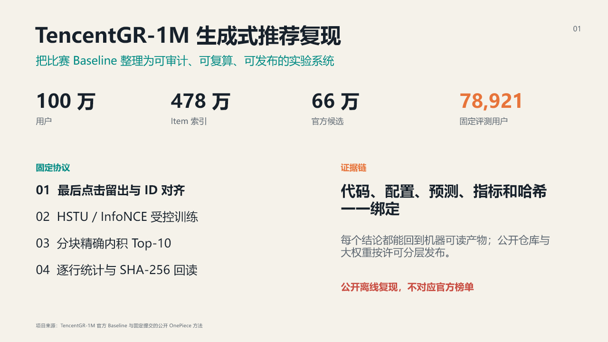
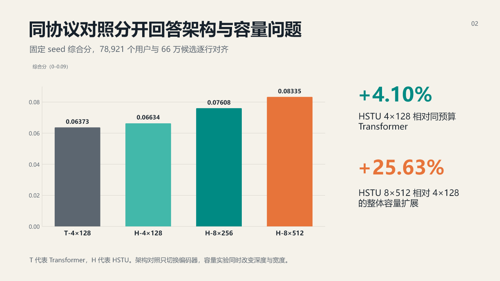
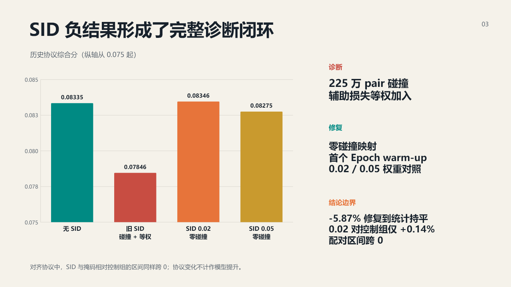

# 3 页面试展示稿

[下载可编辑 PowerPoint](slides/TencentGR_Interview_Deck_CN.pptx) · [逐页讲稿](INTERVIEW_SCRIPTS_CN.md) · [项目展示总览](PROJECT_PORTFOLIO_CN.md)

这套展示稿适合技术面试中的 3 分钟项目介绍。三页全部是内容页，原生柱状图可以在 PowerPoint 中继续编辑；每页备注区已写入对应讲稿与证据来源。

## 第 1 页：问题与系统闭环

面试官应当先理解三件事：项目规模、固定评测协议、结论如何追溯。建议用时 55 秒。

## 第 2 页：架构与容量证据

这一页只讲两个数字：同预算 HSTU 相对 Transformer 的 +4.10%，以及 8×512 相对 4×128 的 +25.63%。前者回答架构问题，后者回答当前预算范围内的整体容量问题。建议用时 55 秒。

## 第 3 页：SID 失败诊断与修复

这一页展示工程判断：先承认 -5.87% 的负结果，再说明碰撞和辅助损失问题，最后把 225 万碰撞降至 0，并将结果修复到统计持平。建议用时 70 秒。

## 现场使用建议

- 默认在第 3 页结束，不额外展示复杂结果表。
- 面试官追问 HSTU 时，打开 [OnePiece 专项问答](ONEPIECE_INTERVIEW_CN.md#5-hstu-和标准-transformer-在代码里到底差在哪里)。
- 追问数据泄漏或样本数量时，打开 [基础链路问答](INTERVIEW_QA_CN.md#3-如何避免目标泄漏)。
- 追问 SID 是否真正提升时，直接回答“当前只修复到持平”，再打开 [SID 结果](ONEPIECE_SID_RESULTS.md#全候选结果)。
- 追问可复现性时，打开 [实验记录](EXPERIMENT_LEDGER.md) 或机器可读的 `metrics/*.json`。

## 数字口径

- 图中综合分使用项目历史协议的 `0.31 × HR@10 + 0.69 × NDCG@10`。
- 所有训练配置只有一个 seed；逐用户配对区间不包含训练 seed 方差。
- 4×128 到 8×512 同时改变深度和宽度。
- SID 0.02 相对无 SID 的 +0.14% 点估计区间跨 0。
- 展示稿不使用基础 Baseline 的 maxlen/MM 2×2 作为主结论；该历史实验的数据构造问题与复跑状态见 [已知限制](KNOWN_LIMITATIONS_CN.md)。
